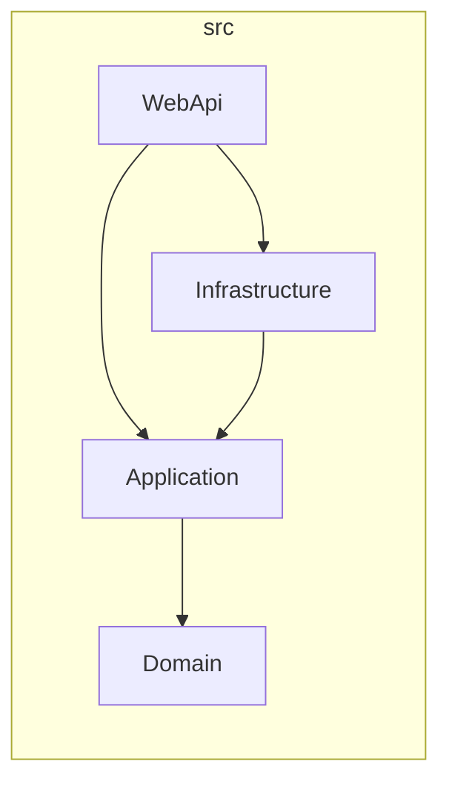
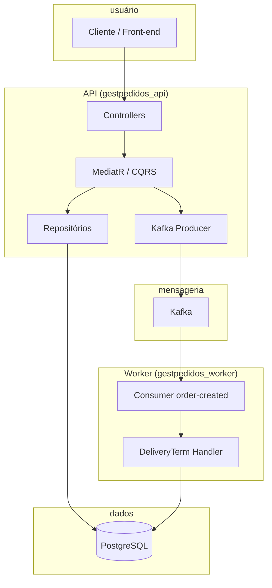

# Minerva Gestão de Pedidos — Back-end

**API REST e Worker em .NET 8 com Clean Architecture, CQRS, PostgreSQL, Kafka e envelope de resposta padronizado para o ecossistema Minerva.**

Este repositório contém o back-end da solução **Minerva Gestão de Pedidos**: a API que o front-end consome e o Worker que processa eventos assíncronos (ex.: geração de prazos de entrega). O documento equilibra visão para stakeholders e detalhe técnico para desenvolvedores e arquitetos.

---

## Visão geral da arquitetura

A solução segue **Clean Architecture** com dependências unidirecionais: o núcleo não conhece infraestrutura nem apresentação.

| Camada | Projeto | Responsabilidade |
|--------|---------|------------------|
| **Domain** | `Minerva.GestaoPedidos.Domain` | Entidades, Value Objects, interfaces de repositório e de leitura, eventos de domínio. Zero dependências externas. |
| **Application** | `Minerva.GestaoPedidos.Application` | Casos de uso (CQRS), DTOs, contratos (handlers de mensagens, publishers), validações e mapeamentos. Depende apenas do Domain. |
| **Infrastructure** | `Minerva.GestaoPedidos.Infrastructure` | Implementação de persistência (EF Core + PostgreSQL), Kafka (producer/consumer), repositórios de leitura/escrita. Implementa contratos do Application. |
| **Presentation** | `Minerva.GestaoPedidos.WebApi` | Controllers, Middlewares, Health Checks, filtros de resposta. Ponto de entrada HTTP. |
| **Worker** | `Minerva.GestaoPedidos.Worker` | Hosted Services que consomem tópicos Kafka e orquestram processamento assíncrono (ex.: criação de DeliveryTerms). |

### CQRS e MediatR

- **Commands** (escrita): por exemplo `CreateOrderCommand` → `CreateOrderCommandHandler`. Persistem entidades no PostgreSQL e publicam eventos no Kafka.
- **Queries** (leitura): por exemplo `GetOrdersPagedQuery` → `GetOrdersPagedQueryHandler`. Consultam **ReadModels** via `IOrderReadRepository`, `ICustomerReadRepository`, etc., sem passar pelas entidades de escrita.
- **MediatR** orquestra comandos e queries; **FluentValidation** e pipelines (ex.: validação, logging) rodam no mesmo fluxo.

A separação entre **entidades de escrita** (aggregates no Domain) e **ReadModels** (projeções otimizadas para listagens e relatórios) permite evoluir o modelo de leitura sem impactar o modelo transacional.

---

## Pontos de entrada

| Aplicação | Finalidade | Acesso |
|-----------|------------|--------|
| **API** (Minerva.GestaoPedidos.WebApi) | Operações do usuário: comandos, queries, autenticação JWT, Swagger. Escrita no PostgreSQL e publicação de eventos no Kafka. | **Porta 5002** (Docker) ou **7187** (HTTPS local). Endpoints: `/swagger`, `/health`, `/health/live`, **api/v1/**. |
| **Worker** (Minerva.GestaoPedidos.Worker) | Processamento assíncrono: consumo do tópico `order-created` → criação de **DeliveryTerms** no PostgreSQL. Health apenas na rede interna. | Sem porta pública; `/health` e `/health/live` para orquestração. |

---

## Stack tecnológica

| Categoria | Tecnologia |
|-----------|------------|
| **Runtime** | .NET 8 |
| **API** | ASP.NET Core Web API |
| **Orquestração** | MediatR (CQRS), FluentValidation, AutoMapper |
| **Persistência** | PostgreSQL 16, Entity Framework Core 8, Npgsql |
| **Mensageria** | Apache Kafka (Confluent.Kafka), tópicos `order-created` e `order-created-dlq` |
| **Resiliência** | Polly (Retry, Circuit Breaker) no producer Kafka e no consumer do Worker |
| **Observabilidade** | Serilog (logs estruturados), Health Checks (Postgres, Kafka, migrações) |
| **Containers** | Docker, Docker Compose |
| **Testes** | xUnit, FluentAssertions, Moq, Reqnroll (BDD), Microsoft.AspNetCore.Mvc.Testing, coverlet |

---

## Destaques de engenharia

### Idempotência

Evitamos **duplicidade de pedidos** (clique duplo, retry de rede, reprocesso Kafka) com:

1. **Chave de idempotência**  
   Hash **SHA256** sobre `CustomerId | PaymentConditionId | TotalAmount | OrderDate` (data truncada ao dia). Mesmo payload de negócio gera a mesma chave.

2. **Dupla proteção**  
   - **Pré-insert**: consulta por `IdempotencyKey` antes de persistir; se existir, retorna **409 Conflict** com mensagem “Pedido já processado.”.  
   - **Constraint no banco**: índice único em `Orders.IdempotencyKey`; em caso de concorrência, violação **23505** é tratada e convertida em `OrderAlreadyExistsException`.

3. **Worker**  
   Um único **DeliveryTerm** por `OrderId`: checagem antes de inserir e constraint única; reprocessamento de mensagem não duplica registro.

Assim, a mesma operação pode ser enviada várias vezes sem criar pedidos ou prazos duplicados.

### Resiliência

- **Kafka Producer (API)**  
  **Polly**: Retry com backoff exponencial e jitter; **Circuit Breaker** (ex.: 50% falhas em 30s abre o circuito por 30s). Falhas são logadas; o handler não bloqueia a resposta ao usuário.

- **Worker (consumer)**  
  **Retry policy** no processamento de mensagens `order-created` (ex.: 3 tentativas com backoff). Se Postgres ou Kafka estiverem indisponíveis, o Worker aguarda um intervalo antes de reconectar, evitando loop de falha.

### Observabilidade

- **X-Correlation-ID e X-Causation-ID**  
  O **CorrelationMiddleware** da API lê ou gera esses headers e os coloca no **Serilog LogContext**. Todas as linhas de log da requisição exibem os IDs.  
  O producer Kafka envia os mesmos headers na mensagem; o Worker os lê e repopula o `CorrelationId` no scope de log. Assim, um mesmo fluxo (request → API → Kafka → Worker) pode ser rastreado da ponta a ponta, alinhado ao que o front-end pode enviar nesses headers.

### Mensageria (API → Worker)

1. **API**: após persistir o pedido no PostgreSQL, publica no tópico **order-created** (payload + headers `X-Correlation-ID`, `X-Causation-ID`).
2. **Worker**: consome **order-created**, valida o pedido, cria o **DeliveryTerm** (prazo de entrega) no mesmo PostgreSQL e faz commit do offset.
3. **DLQ**: tópico **order-created-dlq** para mensagens que falharem após retries (conforme estratégia de dead-letter).

Não há Outbox neste desenho: a publicação é feita após o commit da transação do pedido; em caso de falha do broker, o log permite conciliação.

### Versionamento e padronização da API

- **Base path**: todos os controllers respondem sob **api/v1/** (ex.: `api/v1/Orders`, `api/v1/auth/login`, `api/v1/customers`).
- **Envelope global**  
  Todas as respostas (sucesso e erro) seguem o contrato **ApiResponse&lt;T&gt;**:

```json
{
  "success": true,
  "data": { ... },
  "message": null,
  "errors": null
}
```

Em erro (400, 401, 404, 409, 422, 500), `success` é `false`, `data` é `null`, e `message` / `errors` trazem a mensagem e a lista de erros (ex.: validação). Isso padroniza o consumo pelo front-end e por integrações futuras.

---

## Setup e execução

### Pré-requisitos

- [.NET 8 SDK](https://dotnet.microsoft.com/download/dotnet/8.0)
- [Docker](https://www.docker.com/get-started) e Docker Compose (para Postgres e Kafka)

### 1. Ambiente com Docker Compose

Na raiz do repositório:

```bash
docker compose up -d
```

Isso sobe:

| Serviço | Descrição | Portas (host) |
|---------|-----------|----------------|
| **gestpedidos_api** | API Minerva Gestão de Pedidos | 5002 → 8080 |
| **gestpedidos_worker** | Worker (order-created → DeliveryTerms) | — |
| **minerva_gestaopedidos_postgres** | PostgreSQL 16 | 5434 → 5432 |
| **minerva_gestaopedidos_kafka** | Apache Kafka (KRaft) | 9092 (interno), 9094 (externo) |
| **init_kafka** | Cria tópicos `order-created` e `order-created-dlq` | — |

- **Swagger**: [http://localhost:5002/swagger](http://localhost:5002/swagger)  
- **Health**: [http://localhost:5002/health](http://localhost:5002/health)  
- Logs: `docker compose logs -f gestpedidos_api gestpedidos_worker`

### 2. Execução local (sem Docker para a API/Worker)

Com Postgres e Kafka rodando (ex.: `docker compose up -d` apenas para os serviços de infra):

**API:**

```bash
dotnet run --project src/Presentation/Minerva.GestaoPedidos.WebApi/Minerva.GestaoPedidos.WebApi.csproj
```

**Worker** (requer Postgres e Kafka):

```bash
dotnet run --project src/Worker/Minerva.GestaoPedidos.Worker/Minerva.GestaoPedidos.Worker.csproj
```

Configure connection strings e Kafka via `appsettings.*.json` ou variáveis de ambiente (ex.: `ConnectionStrings__Postgres`, `Kafka__BootstrapServers`). Para desenvolvimento sem Postgres/Kafka, a API pode usar `Database__UseInMemory=true` (consulte configuração do projeto).

### 3. Variáveis de ambiente (referência)

Exemplo de variáveis usadas em produção/Docker (valores reais não devem ser commitados):

| Variável | Uso |
|----------|-----|
| `ASPNETCORE_ENVIRONMENT` | Development / Production |
| `ConnectionStrings__Postgres` | PostgreSQL (API e Worker) |
| `Kafka__BootstrapServers` | Brokers Kafka |
| `Jwt__Secret`, `Jwt__Issuer`, `Jwt__Audience` | Autenticação JWT |

O arquivo `.env.example` na raiz serve de modelo; use `.env` local e mantenha-o fora do controle de versão.

---

## Testes

A estratégia segue uma **pirâmide de testes**:

| Nível | Projeto | Ferramentas | Objetivo |
|-------|---------|-------------|----------|
| **Unitários** | Minerva.GestaoPedidos.UnitTests | xUnit, FluentAssertions, Moq | Handlers, repositórios, regras de negócio isolados. |
| **Integração** | Minerva.GestaoPedidos.IntegrationTests | WebApplicationFactory, EF InMemory/Postgres, FluentAssertions | Controllers, autenticação, envelope ApiResponse, health. Requisições HTTP reais contra a API em memória. |
| **Funcionais (BDD)** | Minerva.GestaoPedidos.FunctionalTests | Reqnroll (Gherkin), WebApplicationFactory | Cenários de ponta a ponta (ex.: login, criar pedido, listar clientes, falhas 400/401/500). |

**Executar todos os testes:**

```bash
dotnet test
```

**Apenas unitários:**

```bash
dotnet test tests/Minerva.GestaoPedidos.UnitTests/Minerva.GestaoPedidos.UnitTests.csproj
```

**Apenas integração:**

```bash
dotnet test tests/Minerva.GestaoPedidos.IntegrationTests/Minerva.GestaoPedidos.IntegrationTests.csproj
```

**Apenas funcionais (BDD):**

```bash
dotnet test tests/Minerva.GestaoPedidos.FunctionalTests/Minerva.GestaoPedidos.FunctionalTests.csproj
```

Cobertura pode ser coletada com **coverlet** (já referenciado nos projetos de teste).

---

## Estrutura do projeto

```
Back-end/
├── src/
│   ├── Core/
│   │   ├── Minerva.GestaoPedidos.Domain/          # Entidades, ReadModels, interfaces
│   │   └── Minerva.GestaoPedidos.Application/     # CQRS (Commands/Queries), DTOs, contratos
│   ├── Infrastructure/
│   │   └── Minerva.GestaoPedidos.Infrastructure/  # EF Core, repositórios, Kafka (producer/handlers)
│   ├── Presentation/
│   │   └── Minerva.GestaoPedidos.WebApi/          # Controllers, Middlewares, HealthChecks, ApiResponse
│   └── Worker/
│       └── Minerva.GestaoPedidos.Worker/          # Consumer order-created, resiliência (Polly)
├── tests/
│   ├── Minerva.GestaoPedidos.UnitTests/
│   ├── Minerva.GestaoPedidos.IntegrationTests/
│   ├── Minerva.GestaoPedidos.FunctionalTests/     # BDD (Reqnroll)
│   └── Minerva.GestaoPedidos.Tests/               # Utilitários compartilhados
├── solutionItens/
│   └── DatabaseScripts/postgres/                  # Scripts SQL de referência / init
├── docker-compose.yml
├── Dockerfile
├── Dockerfile.worker
└── README.md
```

### Dependências entre camadas (Clean Architecture)



O **Worker** referencia Application e Infrastructure (e Domain indiretamente); não referencia a WebApi.

---

## Fluxo simplificado (API + Worker)



---

## Segurança e boas práticas

- **Secrets**: em produção, use variáveis de ambiente ou um gerenciador de segredos (ex.: Azure Key Vault). Não commite senhas em `appsettings`.
- **JWT**: token obtido via `POST api/v1/auth/login`; envie no header `Authorization: Bearer <token>` nas rotas protegidas.
- **Logs**: Health Checks de sucesso (início/fim Postgres e migrações) em nível **Debug**; requisições `GET /health` com 200 não são logadas no request logging, para reduzir ruído.
- **Erros**: StackTrace em respostas de erro apenas em ambiente não-Production; o envelope `ApiResponse` expõe `message` e `errors` de forma padronizada.

---

## Troubleshooting

### Build falha: "The file is being used by another process" (MSB3026 / MSB3027)

A API ou o Worker ainda está em execução e trava as DLLs. Pare a aplicação (Stop no IDE ou encerre o processo `dotnet`/exe) e execute o build novamente.

### Health Check Kafka "falha de metadados"

O health check da API usa apenas **GetMetadata** no broker (sem publicar em tópico). Se o erro persistir, verifique:

- Kafka no ar e acessível em `Kafka__BootstrapServers`
- Tópicos `order-created` e `order-created-dlq` criados (serviço `init_kafka` no docker-compose)

### Container Postgres ou Kafka não sobe

- **Postgres**: confira logs com `docker compose logs minerva_gestaopedidos_postgres`. Se o volume já existia com schema antigo, pode ser necessário `docker compose down -v` e subir de novo.
- **Kafka**: o healthcheck do container usa `kafka-broker-api-versions.sh`; aguarde o `start_period` (ex.: 60s) antes de considerar falha.

---

## Licença

Uso interno / template. Ajuste conforme a política da sua organização.
