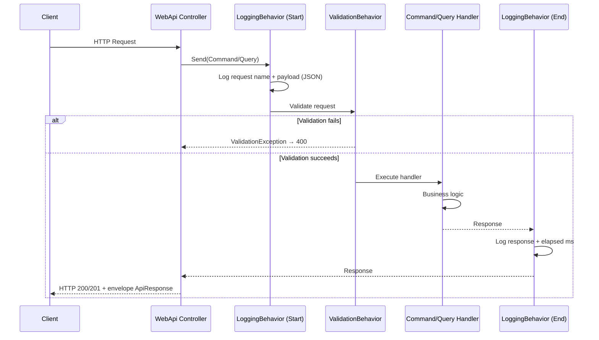

# Estratégia de Logging — Minerva Gestão de Pedidos

**Versão:** 1.1  
**Última Atualização:** Fevereiro 2026  
**Público-Alvo:** Desenvolvedores e Auditores de Segurança

---

## Índice

1. [Visão Geral](#visão-geral)
2. [Arquitetura e Fluxo](#arquitetura-e-fluxo)
3. [Componentes Atuais](#componentes-atuais)
4. [CorrelationId e CausationId](#correlationid-e-causationid)
5. [Boas Práticas e Conformidade](#boas-práticas-e-conformidade)
6. [Extensão: Mascaramento de Dados (PII)](#extensão-mascaramento-de-dados-pii)

---

## Visão Geral

A solução **Minerva Gestão de Pedidos** implementa logging baseado em **MediatR Pipeline Behaviors** e **middleware** na WebApi:

- **LoggingBehavior**: intercepta todas as requisições MediatR (Commands/Queries), registra nome da request, payload e resposta em JSON, além do tempo de processamento.
- **CorrelationMiddleware** e **RequestLoggingMiddleware**: garantem CorrelationId/CausationId no contexto e log de entrada/saída HTTP quando aplicável.
- **Serilog**: configuração via `appsettings`, enriquecimento com `CorrelationId` e `CausationId` no template de log.

Para proteção de PII (LGPD/GDPR), o projeto define o atributo **LogSensitive** para marcar propriedades sensíveis; a implementação de um **LogSanitizer** que use esse atributo pode ser adicionada ao LoggingBehavior para mascarar valores antes de escrever no log (ver seção [Extensão: Mascaramento de Dados](#extensão-mascaramento-de-dados-pii)).

---

## Arquitetura e Fluxo

### Diagrama de Sequência (MediatR)



### Pontos de Interceptação

1. **Início da requisição MediatR**: `LoggingBehavior` loga o nome do request e o payload (serialização JSON com camelCase, sem referências circulares).
2. **Fim da requisição MediatR**: `LoggingBehavior` loga a resposta e o tempo decorrido em ms.

O **GlobalExceptionHandlerMiddleware** captura exceções após o pipeline e registra com CorrelationId; não faz parte do fluxo de logging de request/response do MediatR.

---

## Componentes Atuais

| Componente | Responsabilidade | Localização |
|------------|------------------|-------------|
| **LoggingBehavior** | Intercepta e registra request/resposta MediatR em JSON | `Application/Common/Behaviors/LoggingBehavior.cs` |
| **ValidationBehavior** | Valida requisições antes do handler (FluentValidation) | `Application/Common/Behaviors/ValidationBehavior.cs` |
| **LogSensitiveAttribute** | Marca propriedades sensíveis (para uso futuro em sanitização) | `Application/Common/Attributes/LogSensitiveAttribute.cs` |
| **CorrelationMiddleware** | Gera/propaga CorrelationId e CausationId no HttpContext e Serilog | `WebApi/Middleware/CorrelationMiddleware.cs` |
| **RequestLoggingMiddleware** | Log de requisição HTTP (path, etc.) | `WebApi/Middleware/RequestLoggingMiddleware.cs` |

O **LoggingBehavior** usa `System.Text.Json` para serializar request e response; em caso de falha na serialização, grava `"(falha na serialização)"`. Atualmente **não** aplica mascaramento; campos sensíveis (ex.: senha, email em alguns DTOs) podem aparecer em texto plano nos logs se forem serializados. Recomenda-se não incluir senhas em DTOs de request ou garantir que não sejam logados (ex.: implementando LogSanitizer).

---

## CorrelationId e CausationId

- **CorrelationId**: identificador único por requisição HTTP, propagado no `HttpContext.Items` e no `LogContext` do Serilog. Todas as linhas de log daquela requisição podem incluir o mesmo CorrelationId para rastreabilidade.
- **CausationId**: opcional; pode ser usado para correlacionar a requisição a um evento externo (ex.: id de mensagem). Também propagado para o CreateOrderCommand quando disponível no controller.

Template de console (exemplo em `Program.cs`):

```
[{Timestamp:HH:mm:ss} {Level:u3}] CorrelationId={CorrelationId} CausationId={CausationId} {Message:lj}{NewLine}{Exception}
```

---

## Boas Práticas e Conformidade

### LGPD / GDPR

- **Minimização**: evite logar payloads desnecessários em produção; use níveis de log (ex.: Debug para payload completo).
- **Proteção de PII**: marque propriedades sensíveis com `[LogSensitive]` e, quando o **LogSanitizer** estiver implementado, elas serão mascaradas automaticamente.
- **Retenção**: defina política de retenção de logs; logs não devem expor dados sensíveis em claro.

### Checklist de Segurança

- [ ] Campos de senha não devem ser incluídos em DTOs que passam pelo LoggingBehavior sem mascaramento.
- [ ] Em produção, avaliar nível de log (Information vs Debug) para reduzir exposição de dados.
- [ ] Quando implementado, garantir que todos os campos sensíveis (email, CPF, token) estejam marcados com `[LogSensitive]`.

---

## Extensão: Mascaramento de Dados (PII)

O projeto já define **LogSensitiveAttribute** para marcar propriedades que contêm dados sensíveis. Exemplo:

```csharp
public record CreateUserCommand(
    string FirstName,
    string LastName,
    [property: LogSensitive] string Email,
    bool Active
) : IRequest<UserDto>;
```

Para ativar **mascaramento automático** nos logs:

1. Implementar uma classe **LogSanitizer** que, via Reflection (com cache por tipo), descubra propriedades marcadas com `[LogSensitive]` e substitua os valores por `"*** MASKED ***"` (ou similar) na representação JSON usada para log.
2. No **LoggingBehavior**, antes de chamar `JsonSerializer.Serialize`, passar o objeto pelo LogSanitizer (ou serializar para um nó JSON e mascarar as propriedades conhecidas).

Com isso, os logs passam a atender melhor aos requisitos de LGPD/GDPR sem expor PII em texto plano.

---

## Referências

- [MediatR Pipeline Behaviors](https://github.com/jbogard/MediatR/wiki/Behaviors)
- [Serilog](https://serilog.net/)
- [LGPD - Lei Geral de Proteção de Dados](https://www.gov.br/cidadania/pt-br/acesso-a-informacao/lgpd)
- [cqrs-mediatr.md](./cqrs-mediatr.md) — Pipelines e ordem dos Behaviors

---

*Documentação alinhada ao projeto Minerva.GestaoPedidos.WebApi e Minerva.GestaoPedidos.Application.*
