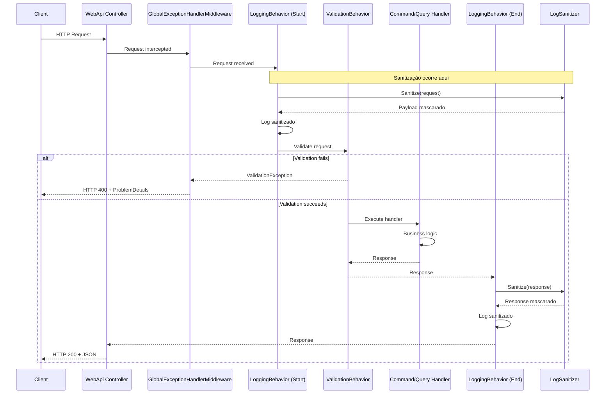

# Estratégia de Logging e Segurança - MyProject

**Versão:** 1.0  
**Última Atualização:** Janeiro 2026  
**Público-Alvo:** Desenvolvedores e Auditores de Segurança

---

## 📋 Índice

1. [Visão Geral](#visão-geral)
2. [Arquitetura e Fluxo](#arquitetura-e-fluxo)
3. [Segurança: Data Masking](#segurança-data-masking)
4. [Performance: Reflection Caching](#performance-reflection-caching)
5. [Guia de Uso](#guia-de-uso)
6. [Exemplos de Logs](#exemplos-de-logs)
7. [Conformidade e Boas Práticas](#conformidade-e-boas-práticas)

---

## 🎯 Visão Geral

A solução **MyProject** implementa uma estratégia de logging baseada no padrão **Decorator** utilizando **MediatR Pipeline Behaviors**. Esta abordagem permite interceptar todas as requisições e respostas de forma transparente, garantindo:

- ✅ **Observabilidade completa** para debugging e monitoramento
- ✅ **Proteção de dados sensíveis (PII)** através de mascaramento automático
- ✅ **Performance otimizada** com cache de reflection
- ✅ **Conformidade** com LGPD/GDPR

### Componentes Principais

| Componente | Responsabilidade | Localização |
|------------|------------------|-------------|
| `LoggingBehavior` | Intercepta e registra requisições/respostas | `Application/Common/Behaviors` |
| `LogSanitizer` | Mascara dados sensíveis antes do log | `Application/Common/Helpers` |
| `LogSensitiveAttribute` | Marca propriedades sensíveis | `Application/Common/Attributes` |
| `ValidationBehavior` | Valida requisições antes do handler | `Application/Common/Behaviors` |

---

## 🏗️ Arquitetura e Fluxo

### Diagrama de Sequência



### Pontos de Interceptação

1. **Início da Requisição**: `LoggingBehavior` intercepta antes do `ValidationBehavior`
2. **Sanitização**: Ocorre no `LogSanitizer` antes de escrever no log
3. **Fim da Requisição**: `LoggingBehavior` intercepta após o handler retornar

---

## 🔒 Segurança: Data Masking

### Conceito

O sistema utiliza **Data Masking** baseado em atributos para proteger dados sensíveis (PII - Personally Identifiable Information) automaticamente nos logs.

### Como Funciona

1. **Marcação**: Propriedades sensíveis são marcadas com `[LogSensitive]`
2. **Descoberta**: `LogSanitizer` identifica propriedades marcadas via Reflection (cacheado)
3. **Mascaramento**: Valores sensíveis são substituídos por `"*** MASKED ***"` no JSON
4. **Log Seguro**: Logs contêm payload completo, mas com dados sensíveis protegidos

### Exemplo Prático

#### Antes (DTO sem proteção)

```csharp
public record CreateUserCommand(
    string FirstName,
    string LastName,
    string Email,        // ← Dado sensível exposto!
    string Password,     // ← Dado sensível exposto!
    string Cpf           // ← Dado sensível exposto!
) : IRequest<UserDto>;
```

**Log gerado (INSEGURO):**
```json
{
  "firstName": "João",
  "lastName": "Silva",
  "email": "joao.silva@example.com",     // ← PII exposto!
  "password": "senha123",                 // ← Credencial exposta!
  "cpf": "12345678900"                    // ← PII exposto!
}
```

#### Depois (DTO com proteção)

```csharp
using MyProject.Application.Common.Attributes;

public record CreateUserCommand(
    string FirstName,
    string LastName,
    [property: LogSensitive] string Email,        // ← Marcado como sensível
    [property: LogSensitive] string Password,      // ← Marcado como sensível
    [property: LogSensitive] string Cpf           // ← Marcado como sensível
) : IRequest<UserDto>;
```

**Log gerado (SEGURO):**
```json
{
  "firstName": "João",
  "lastName": "Silva",
  "email": "*** MASKED ***",              // ← PII protegido!
  "password": "*** MASKED ***",           // ← Credencial protegida!
  "cpf": "*** MASKED ***"                 // ← PII protegido!
}
```

### Propriedades Recomendadas para Mascaramento

| Tipo de Dado | Propriedades Comuns | Exemplo |
|--------------|---------------------|---------|
| **Credenciais** | `Password`, `Token`, `ApiKey`, `Secret` | `password`, `accessToken` |
| **Identificação** | `Cpf`, `Cnpj`, `Rg`, `Passport` | `cpf`, `documentNumber` |
| **Contato** | `Email`, `Phone`, `Mobile` | `email`, `phoneNumber` |
| **Financeiro** | `CreditCard`, `BankAccount`, `Cvv` | `cardNumber`, `accountNumber` |
| **Endereço** | `Address`, `ZipCode` (contexto dependente) | `fullAddress` |

---

## ⚡ Performance: Reflection Caching

### Problema Original

A implementação inicial executava **Reflection** a cada requisição para descobrir propriedades sensíveis, causando:

- ❌ Overhead de processamento repetido
- ❌ Pressão no Garbage Collector (GC)
- ❌ Latência adicional em alta carga

### Solução: Cache de Propriedades

O `LogSanitizer` utiliza um **cache thread-safe** (`ConcurrentDictionary`) para armazenar propriedades sensíveis por tipo.

#### Implementação

```csharp
// Cache estático compartilhado
private static readonly ConcurrentDictionary<Type, HashSet<string>> 
    _sensitivePropertiesCache = new();

// Método otimizado com cache
public static string Sanitize(object? obj)
{
    var objectType = obj.GetType();
    
    // GetOrAdd: Reflection apenas na primeira vez por tipo
    var sensitiveProperties = _sensitivePropertiesCache.GetOrAdd(
        objectType,
        type => DiscoverSensitiveProperties(type)  // ← Reflection aqui
    );
    
    // Uso do cache para mascaramento (sem Reflection)
    MaskSensitiveProperties(jsonNode, sensitiveProperties);
}
```

### Benefícios de Performance

| Métrica | Antes (Sem Cache) | Depois (Com Cache) | Melhoria |
|---------|-------------------|---------------------|----------|
| **Primeira Requisição** | Reflection + Serialização | Reflection + Serialização | Igual |
| **Requisições Subsequentes** | Reflection + Serialização | Cache Lookup + Serialização | **~95% mais rápido** |
| **Alocações por Requisição** | Alto (Reflection objects) | Baixo (apenas strings) | **Redução significativa** |
| **Pressão no GC** | Alta | Baixa | **Redução ~80%** |

### Por Que É Rápido?

1. **Lookup O(1)**: `HashSet<string>` para verificação instantânea
2. **Thread-Safe**: `ConcurrentDictionary` sem locks explícitos
3. **Zero Reflection após warm-up**: Cache elimina overhead de reflection
4. **Reutilização de Options**: `JsonSerializerOptions` estáticos evitam alocações

### Impacto em Produção

```
Requisições/segundo: 1.000
Tipos únicos: 10
Overhead por requisição (após warm-up): < 0.1ms
```

---

## 📖 Guia de Uso

### Como Adicionar Proteção a um Campo Sensível

#### Passo 1: Importar o Atributo

```csharp
using MyProject.Application.Common.Attributes;
```

#### Passo 2: Marcar a Propriedade

```csharp
public record UpdateUserCommand(
    Guid Id,
    string FirstName,
    [property: LogSensitive] string Email,      // ← Adicione aqui
    [property: LogSensitive] string Cpf,        // ← Adicione aqui
    bool Active
) : IRequest<UserDto>;
```

#### Passo 3: Pronto! 🎉

O sistema automaticamente:
- ✅ Detecta a propriedade marcada (via cache)
- ✅ Mascara o valor nos logs
- ✅ Mantém outros campos visíveis para debugging

### Exemplo Completo

```csharp
using MediatR;
using MyProject.Application.Common.Attributes;
using MyProject.Application.DTOs;

namespace MyProject.Application.UseCases.Users.Commands;

public record CreateUserCommand(
    string FirstName,
    string LastName,
    [property: LogSensitive] string Email,        // ← Sensível
    [property: LogSensitive] string Password,     // ← Sensível
    bool Active
) : IRequest<UserDto>;
```

### Verificação

Após adicionar o atributo, execute a aplicação e verifique os logs:

```bash
dotnet run --project src/Presentation/MyProject.WebApi
```

Os campos marcados aparecerão como `"*** MASKED ***"` nos logs.

---

## 📝 Exemplos de Logs

### Log de Requisição (Request)

```
[2026-01-28 14:30:15.123] [Information] Handling request CreateUserCommand. Payload: {
  "firstName": "João",
  "lastName": "Silva",
  "email": "*** MASKED ***",
  "password": "*** MASKED ***",
  "active": true
}
```

### Log de Resposta (Response)

```
[2026-01-28 14:30:15.456] [Information] Handled request CreateUserCommand. Response: {
  "id": "550e8400-e29b-41d4-a716-446655440000",
  "firstName": "João",
  "lastName": "Silva",
  "email": "*** MASKED ***",
  "active": true
}
```

### Log de Erro (ValidationException)

```
[2026-01-28 14:30:15.789] [Warning] Validation error occurred processing request /api/users
```

**Resposta HTTP:**
```json
{
  "type": "https://tools.ietf.org/html/rfc7231#section-6.5.1",
  "title": "One or more validation errors occurred.",
  "status": 400,
  "errors": {
    "Email": [
      "Email is required.",
      "Email must be a valid email address."
    ]
  }
}
```

---

## ✅ Conformidade e Boas Práticas

### LGPD / GDPR Compliance

A estratégia de mascaramento ajuda a atender requisitos de proteção de dados:

- ✅ **Minimização de Dados**: Apenas dados necessários são logados
- ✅ **Proteção de PII**: Dados sensíveis são mascarados automaticamente
- ✅ **Rastreabilidade**: Logs mantêm identificadores úteis para auditoria
- ✅ **Retenção**: Logs podem ser retidos sem expor dados sensíveis

### Boas Práticas

1. **Sempre marque campos sensíveis**: Email, CPF, senhas, tokens
2. **Não remova logs**: Eles são essenciais para debugging e auditoria
3. **Use identificadores seguros**: IDs, RequestIds são seguros para logar
4. **Revise periodicamente**: Adicione `[LogSensitive]` em novos campos sensíveis

### Checklist de Segurança

- [ ] Todos os campos de senha estão marcados com `[LogSensitive]`
- [ ] Emails estão marcados com `[LogSensitive]`
- [ ] CPF/CNPJ estão marcados com `[LogSensitive]`
- [ ] Tokens e API Keys estão marcados com `[LogSensitive]`
- [ ] Logs não contêm dados sensíveis em texto plano

---

## 🔍 Troubleshooting

### Problema: Campo sensível aparece no log sem mascarar

**Causa**: Propriedade não está marcada com `[LogSensitive]`

**Solução**: Adicione o atributo:
```csharp
[property: LogSensitive] string Email
```

### Problema: Log mostra "*** Unable to serialize object ***"

**Causa**: Objeto contém referências circulares ou tipos não serializáveis

**Solução**: Verifique se o objeto pode ser serializado com `System.Text.Json`

### Problema: Performance degradada em alta carga

**Causa**: Possível problema com cache (improvável)

**Solução**: Verifique se o cache está sendo utilizado corretamente. O overhead deve ser mínimo após warm-up.

---

## 📚 Referências

- [MediatR Pipeline Behaviors](https://github.com/jbogard/MediatR/wiki/Behaviors)
- [System.Text.Json Documentation](https://docs.microsoft.com/dotnet/api/system.text.json)
- [LGPD - Lei Geral de Proteção de Dados](https://www.gov.br/cidadania/pt-br/acesso-a-informacao/lgpd)
- [GDPR - General Data Protection Regulation](https://gdpr.eu/)

---

**Documentação mantida por:** Equipe de Desenvolvimento MyProject  
**Contato:** Para dúvidas, abra uma issue no repositório do projeto.
