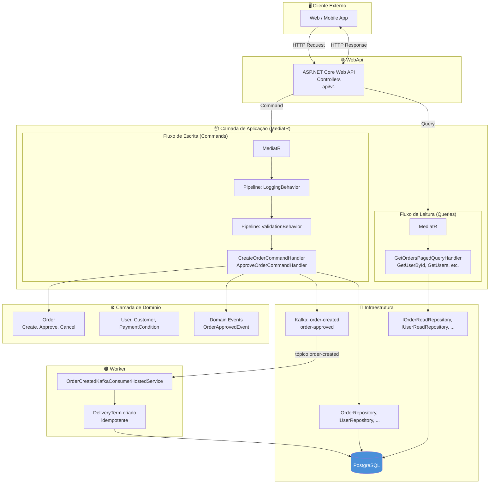

# Diagrama de Arquitetura — CQRS, PostgreSQL e Kafka

Diagrama da solução **Minerva Gestão de Pedidos**: CQRS, persistência em **PostgreSQL** (escrita e leitura), e eventos assíncronos via **Kafka** (order-created, order-approved), com **Worker** consumindo `order-created` para criar DeliveryTerm.

---

## Visão geral do fluxo

---

## Fluxo: Criar pedido e evento Kafka

1. Cliente envia **POST /api/v1/orders**.
2. Controller envia **CreateOrderCommand** ao MediatR (Logging → Validation → Handler).
3. **CreateOrderCommandHandler** valida cliente/condição de pagamento, cria **Order** (domínio), persiste via **IOrderRepository** (PostgreSQL).
4. Handler publica no Kafka (**order-created**) com dados do pedido.
5. Resposta 201 com OrderDto ao cliente.
6. **Worker** consome `order-created`, cria **DeliveryTerm** (10 dias) no Postgres (idempotente por OrderId).

---

## Fluxo: Aprovar pedido

1. Cliente envia **PUT /api/v1/orders/{id}/approve** (perfil ADMIN/MANAGER/ANALYST).
2. **ApproveOrderCommandHandler** carrega Order, chama `Order.Approve(approvedBy)`, persiste e publica no Kafka (**order-approved**).
3. Resposta 200 com OrderDto (status Pago, approvedBy, approvedAt).

---

## Legenda

| Elemento | Significado |
|----------|-------------|
| **PostgreSQL** | Único banco transacional: escrita e leitura (repositórios com AsNoTracking para queries). |
| **Kafka** | Eventos order-created (Worker cria DeliveryTerm) e order-approved (integrações externas). |
| **Worker** | Processo separado; consome order-created, persiste DeliveryTerm; retry e DLQ em falha. |

---

## Referência

- [architecture.md](./architecture.md) — Camadas e Clean Architecture  
- [persistence-polyglot.md](./persistence-polyglot.md) — Persistência e Kafka  
- [cqrs-mediatr.md](./cqrs-mediatr.md) — CQRS e MediatR Pipelines  
