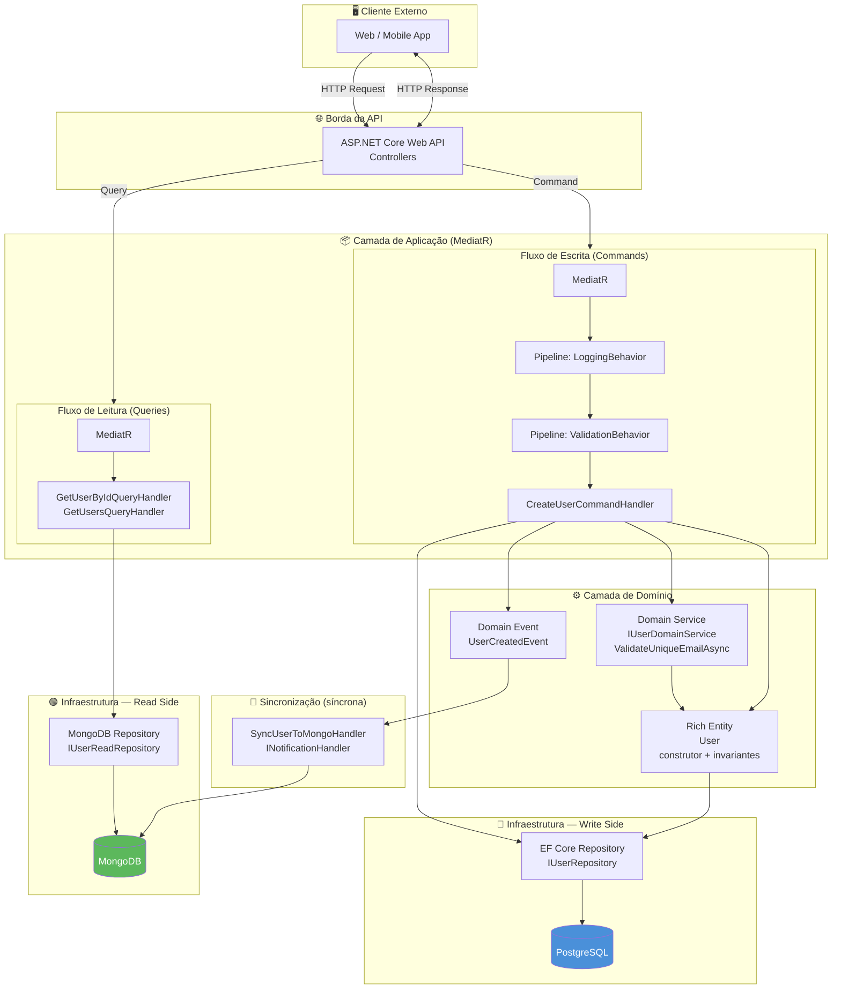
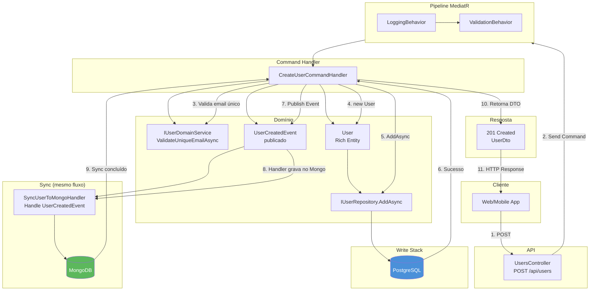

# Diagrama de Arquitetura — CQRS com Persistência Poliglota

Diagrama da solução **Template 1**: CQRS, Write Stack (PostgreSQL) e Read Stack (MongoDB), com sincronização **síncrona** via Domain Events.

---

## Visão geral do fluxo

---

## Fluxo crítico: Command com sincronização síncrona

O diagrama abaixo detalha o **fluxo síncrono** de um Command: escrita no Postgres, disparo do Domain Event, gravação no MongoDB pelo Sync Handler e só então a resposta HTTP ao cliente.

---

## Legenda

| Cor / elemento | Significado |
|----------------|-------------|
| **Azul** | Banco relacional (PostgreSQL) — Write Side |
| **Verde** | Banco NoSQL (MongoDB) — Read Side |
| **Fluxo contínuo** | Command → Postgres → Event → Sync Handler → MongoDB → Response (tudo no mesmo request, síncrono) |
| **Queries** | Apenas leem do MongoDB via IUserReadRepository; não passam pelo Write Stack |

---

## Referência

- [architecture.md](./architecture.md) — Camadas e Clean Architecture  
- [persistence-polyglot.md](./persistence-polyglot.md) — Persistência poliglota e Domain Events  
- [cqrs-mediatr.md](./cqrs-mediatr.md) — CQRS e MediatR Pipelines  
