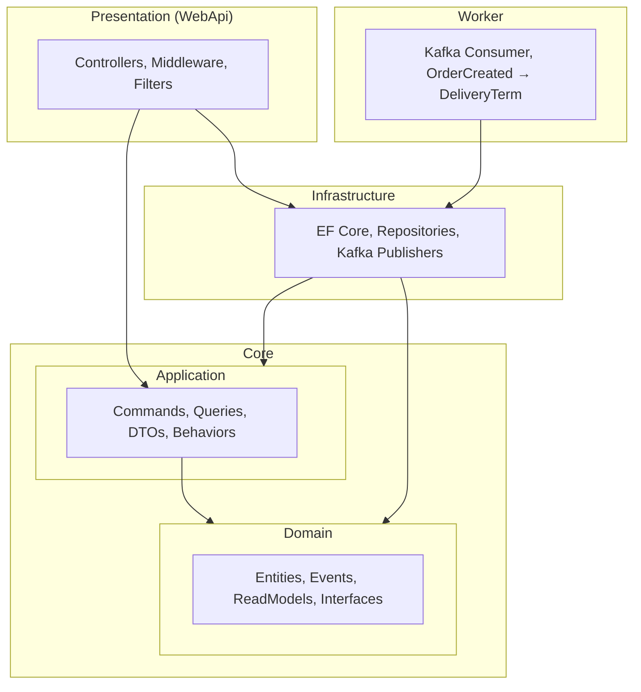

# Arquitetura da Solução

Este documento descreve a **Clean Architecture** adotada no **Minerva Gestão de Pedidos**, a divisão em camadas e os benefícios dessa separação.

---

## O que é Clean Architecture?

Clean Architecture (Uncle Bob) organiza o código em **camadas concêntricas**, onde as regras de negócio ficam no centro e as dependências apontam **sempre para dentro**: infraestrutura e apresentação dependem do núcleo, nunca o contrário.

Isso garante:

- **Independência de frameworks**: o domínio não conhece ASP.NET, EF Core ou Kafka.
- **Testabilidade**: regras de negócio podem ser testadas sem banco ou HTTP.
- **Independência de UI e de persistência**: trocar API ou banco não exige reescrever o núcleo.

---

## Divisão de Camadas

A solução está organizada em **quatro pilares** dentro da pasta `src/`:



| Camada | Projeto | Responsabilidade |
|--------|---------|-------------------|
| **Core / Domain** | `Minerva.GestaoPedidos.Domain` | Entidades (Order, User, Customer, PaymentCondition, DeliveryTerm), Value Objects, eventos de domínio, interfaces de repositório e de Domain Services. **Não depende de nada.** |
| **Core / Application** | `Minerva.GestaoPedidos.Application` | Casos de uso (CQRS), DTOs, validação (FluentValidation), pipelines (MediatR), mapeamento (AutoMapper). Depende apenas do **Domain**. |
| **Infrastructure** | `Minerva.GestaoPedidos.Infrastructure` | Implementação de repositórios (EF Core / PostgreSQL), Domain Services, publicadores Kafka (order-created, order-approved). Depende de **Application** e **Domain**. |
| **Presentation** | `Minerva.GestaoPedidos.WebApi` | Controllers, middleware (CorrelationId, GlobalExceptionHandler, RequestLogging), filters (ApiResponse envelope). Depende de **Application** e **Infrastructure**. |
| **Worker** | `Minerva.GestaoPedidos.Worker` | Consumidor Kafka (order-created), criação de DeliveryTerm no PostgreSQL, health checks (Postgres, Kafka). Depende de **Infrastructure** e **Application** (contratos). |

---

## Estrutura Física

```
src/
├── Core/
│   ├── Minerva.GestaoPedidos.Domain/       # Entidades, Interfaces, Events, ReadModels
│   └── Minerva.GestaoPedidos.Application/ # Commands, Queries, DTOs, Behaviors, Mappings
├── Infrastructure/
│   └── Minerva.GestaoPedidos.Infrastructure/ # Data, Repositories, Kafka, Identity
├── Presentation/
│   └── Minerva.GestaoPedidos.WebApi/       # Controllers, Middleware, Program.cs
└── Worker/
    └── Minerva.GestaoPedidos.Worker/       # Kafka consumer (order-created → DeliveryTerm)
```

A pasta **tests/** espelha essa organização (UnitTests, IntegrationTests, FunctionalTests).

---

## Persistência e eventos

- **Escrita e leitura**: PostgreSQL (EF Core). Repositórios de escrita e de leitura (com `AsNoTracking`) usam o mesmo banco; a separação CQRS é mantida na aplicação.
- **Eventos assíncronos**: Kafka. A API publica em `order-created` (ao criar pedido) e em `order-approved` (ao aprovar). O Worker consome `order-created` e persiste DeliveryTerm no Postgres (idempotente).

---

## Por que essa separação?

1. **Domain no centro**: regras e invariantes vivem nas entidades e em Domain Services; não há “lógica espalhada” em controllers ou repositórios.
2. **Application orquestra**: Commands e Queries definem o que a aplicação faz; validação e logging ficam em pipelines reutilizáveis (MediatR).
3. **Infrastructure é plugável**: trocar Postgres por outro SQL ou Kafka por outra fila exige mudanças só na Infrastructure.
4. **Presentation fina**: controllers apenas enviam requests ao MediatR e devolvem respostas; sem regras de negócio.
5. **Worker desacoplado**: processamento assíncrono (ex.: prazo de entrega) em processo separado, com resiliência (retry, DLQ, circuit breaker).

Com isso, o projeto permanece **manutenível**, **testável** e **pronto para evolução** (novos recursos, novos tópicos Kafka) sem quebrar o núcleo.
