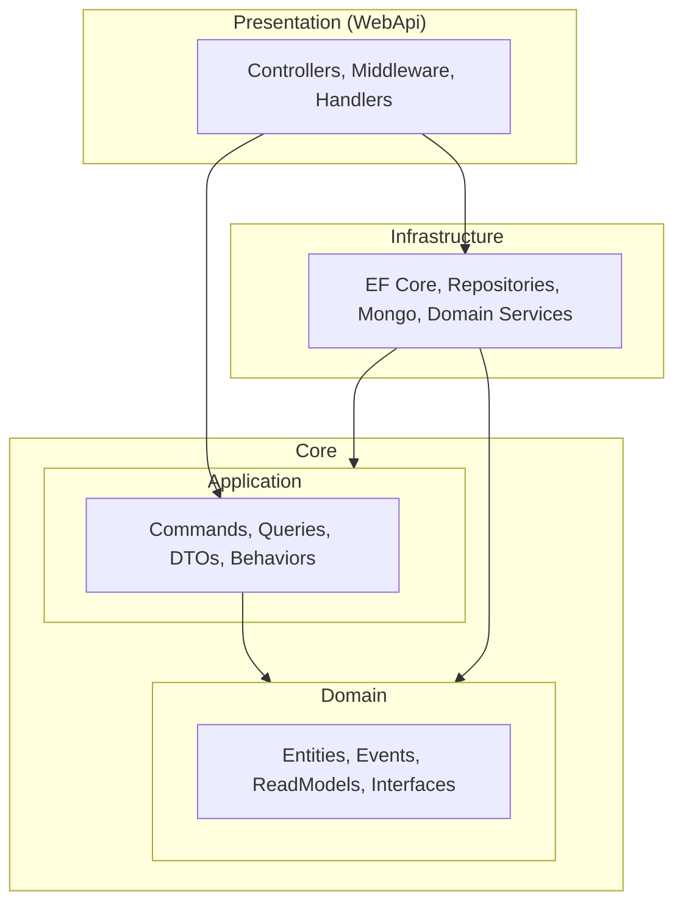

# Arquitetura da Solução

Este documento descreve a **Clean Architecture** adotada no template, a divisão em camadas e os benefícios dessa separação.

---

## O que é Clean Architecture?

Clean Architecture (Uncle Bob) organiza o código em **camadas concêntricas**, onde as regras de negócio ficam no centro e as dependências apontam **sempre para dentro**: infraestrutura e apresentação dependem do núcleo, nunca o contrário.

Isso garante:

- **Independência de frameworks**: o domínio não conhece ASP.NET, EF Core ou MongoDB.
- **Testabilidade**: regras de negócio podem ser testadas sem banco ou HTTP.
- **Independência de UI e de persistência**: trocar API ou banco não exige reescrever o núcleo.

---

## Divisão de Camadas

A solução está organizada em **quatro pilares** dentro da pasta `src/`:



| Camada | Projeto | Responsabilidade |
|--------|---------|-------------------|
| **Core / Domain** | `MyProject.Domain` | Entidades, Value Objects, eventos de domínio, interfaces de repositório e de Domain Services. **Não depende de nada.** |
| **Core / Application** | `MyProject.Application` | Casos de uso (CQRS), DTOs, validação (FluentValidation), pipelines (MediatR), mapeamento (AutoMapper). Depende apenas do **Domain**. |
| **Infrastructure** | `MyProject.Infrastructure` | Implementação de repositórios (EF Core, MongoDB), Domain Services, event handlers. Depende de **Application** e **Domain**. |
| **Presentation** | `MyProject.WebApi` | Controllers, exception handler, configuração do pipeline HTTP. Depende de **Application** e **Infrastructure**. |

---

## Estrutura Física

```
src/
├── Core/
│   ├── MyProject.Domain/          # Entidades, Interfaces, Events, ReadModels
│   └── MyProject.Application/     # Commands, Queries, DTOs, Behaviors, Mappings
├── Infrastructure/
│   └── MyProject.Infrastructure/ # Data, Repositories, Services, EventHandlers
└── Presentation/
    └── MyProject.WebApi/         # Controllers, Handlers, Program.cs
```

A pasta **tests/** espelha essa organização (UnitTests, IntegrationTests, FunctionalTests).

---

## Por que essa separação?

1. **Domain no centro**: regras e invariantes vivem nas entidades e em Domain Services; não há “lógica espalhada” em controllers ou repositórios.
2. **Application orquestra**: Commands e Queries definem o que a aplicação faz; validação e logging ficam em pipelines reutilizáveis.
3. **Infrastructure é plugável**: trocar Postgres por outro SQL ou Mongo por outro NoSQL exige mudanças só na Infrastructure.
4. **Presentation fina**: controllers apenas enviam requests ao MediatR e devolvem respostas; sem regras de negócio.

Com isso, o template permanece **manutenível**, **testável** e **pronto para evolução** (novos recursos, novos storages) sem quebrar o núcleo.
