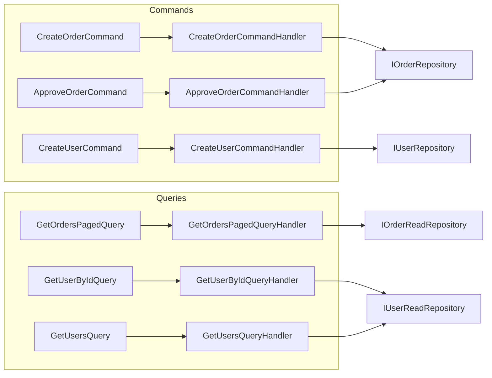
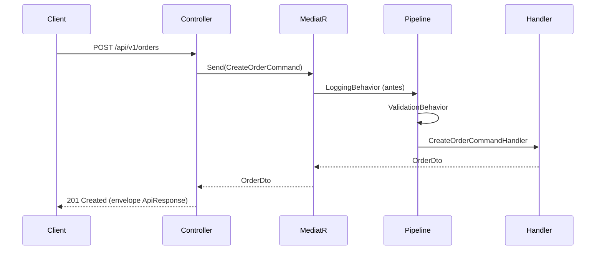

# CQRS e MediatR

Este documento detalha o uso de **CQRS** (Command Query Responsibility Segregation) e do **MediatR** no **Minerva Gestão de Pedidos**.

---

## O que é CQRS?

CQRS separa **operações que alteram estado** (Commands) das **operações que apenas leem** (Queries). No projeto:

- **Commands**: criam ou alteram dados (ex.: `CreateOrderCommand`, `ApproveOrderCommand`, `CreateUserCommand`). São tratados por **Handlers** que usam repositórios de escrita, publicam eventos (Kafka) quando aplicável e garantem regras de negócio.
- **Queries**: apenas leem dados (ex.: `GetOrdersPagedQuery`, `GetUserByIdQuery`, `GetUsersQuery`). São tratados por **Handlers** que usam repositórios de leitura (PostgreSQL com `AsNoTracking`).

Benefícios: responsabilidades claras, leitura e escrita otimizadas de forma independente (mesmo usando o mesmo banco) e integração natural com eventos (Kafka).

---

## Separação Commands x Queries



| Tipo    | Exemplo                 | Handler                      | Persistência / Ação |
|---------|-------------------------|------------------------------|----------------------|
| Command | `CreateOrderCommand`    | `CreateOrderCommandHandler`  | `IOrderRepository` + publica Kafka `order-created` |
| Command | `ApproveOrderCommand`   | `ApproveOrderCommandHandler` | `IOrderRepository` + publica Kafka `order-approved` |
| Command | `CreateUserCommand`     | `CreateUserCommandHandler`  | `IUserRepository` + Domain Service (email único) |
| Query   | `GetOrdersPagedQuery`   | `GetOrdersPagedQueryHandler`| `IOrderReadRepository` (Postgres) |
| Query   | `GetUserByIdQuery`      | `GetUserByIdQueryHandler`   | `IUserReadRepository` (Postgres) |
| Query   | `GetUsersQuery`         | `GetUsersQueryHandler`      | `IUserReadRepository` (Postgres) |

Lookups (Clientes, Condições de pagamento) são acessados diretamente pelos controllers via `ICustomerReadRepository` e `IPaymentConditionReadRepository`, sem MediatR, por serem listagens simples.

---

## Papel do MediatR

O **MediatR** atua como **mediador**: o controller não chama o handler diretamente; envia uma request (Command ou Query) e o MediatR encaminha ao handler registrado.



- **Registro**: `AddMediatR` escaneia os assemblies da Application e da Infrastructure (para handlers e event handlers, se houver).
- **Controller**: apenas `await _mediator.Send(command)` ou `await _mediator.Send(query)`; sem lógica de negócio.

---

## Pipelines (Behaviors)

Behaviors do MediatR envolvem a execução do handler e permitem cross-cutting concerns sem poluir os handlers.

| Behavior           | Ordem | Função |
|--------------------|--------|--------|
| **LoggingBehavior**   | 1º | Loga o nome da request e o payload (serialização JSON). |
| **ValidationBehavior**| 2º | Executa os validadores FluentValidation; em falha, lança `ValidationException` (400). |

A ordem é: **Logging → Validation → Handler**. Validação falha antes de chegar ao handler.

Para proteção de PII em logs, pode-se estender com um **LogSanitizer** e atributos (ex.: `[LogSensitive]`) — ver [LOGGING_STRATEGY.md](./LOGGING_STRATEGY.md) se implementado.

---

## Organização em Vertical Slices

Commands e Queries estão agrupados por **feature** (vertical slices):

```
Application/UseCases/
├── Orders/
│   ├── Commands/
│   │   ├── CreateOrder/
│   │   │   ├── CreateOrderCommand.cs
│   │   │   ├── CreateOrderCommandHandler.cs
│   │   │   └── CreateOrderCommandValidator.cs
│   │   └── ApproveOrder/
│   │       ├── ApproveOrderCommand.cs
│   │       ├── ApproveOrderCommandHandler.cs
│   │       └── ApproveOrderCommandValidator.cs
│   └── Queries/
│       └── GetOrdersPaged/
│           ├── GetOrdersPagedQuery.cs
│           ├── GetOrdersPagedQueryHandler.cs
│           └── GetOrdersPagedQueryValidator.cs
└── Users/
    ├── Commands/
    │   └── CreateUser/
    │       ├── CreateUserCommand.cs
    │       ├── CreateUserCommandHandler.cs
    │       └── CreateUserCommandValidator.cs
    └── Queries/
        ├── GetUserById/
        │   ├── GetUserByIdQuery.cs
        │   └── GetUserByIdQueryHandler.cs
        └── GetUsers/
            ├── GetUsersQuery.cs
            └── GetUsersQueryHandler.cs
```

Cada pasta concentra o que é necessário para um caso de uso (request, handler, validador), facilitando manutenção e descoberta.

---

## Roles e autorização

- **Criar pedido** (`POST /api/v1/orders`): **ADMIN** ou **MANAGER** (`ApplicationRoles.CreateOrderRoles`). ANALYST retorna 403.
- **Aprovar pedido** (`PUT /api/v1/orders/{id}/approve`): **ADMIN**, **MANAGER** ou **ANALYST** (`ApplicationRoles.ApproveOrderRoles`).
- Demais endpoints (Users, Customers, PaymentConditions, listagem de pedidos): qualquer usuário autenticado (Bearer).

Roles são definidas em `Minerva.GestaoPedidos.Domain.Constants.ApplicationRoles`.
