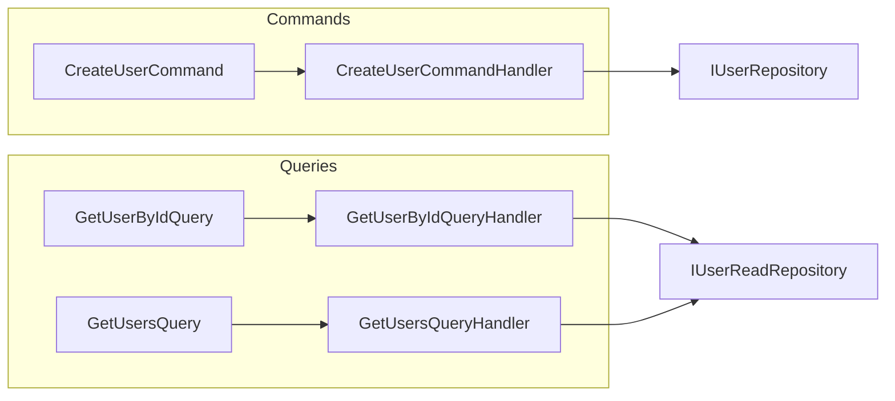
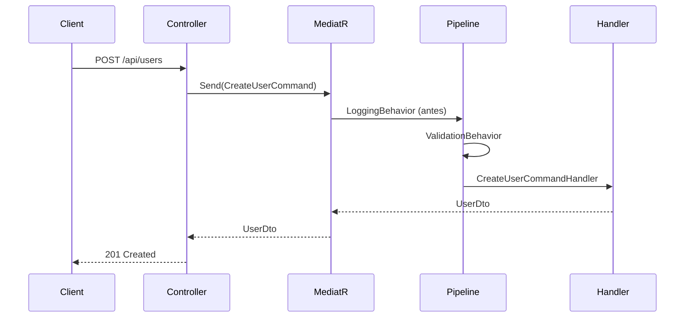

# CQRS e MediatR

Este documento detalha o uso de **CQRS** (Command Query Responsibility Segregation) e do **MediatR** para orquestrar Commands, Queries e Pipelines.

---

## O que é CQRS?

CQRS separa **operações que alteram estado** (Commands) das **operações que apenas leem** (Queries). No template:

- **Commands**: criam ou alteram dados (ex.: `CreateUserCommand`). São tratados por **Handlers** que usam repositórios de escrita e publicam eventos de domínio.
- **Queries**: apenas leem dados (ex.: `GetUserByIdQuery`, `GetUsersQuery`). São tratados por **Handlers** que usam repositórios de leitura (MongoDB no cenário poliglota).

Benefícios: responsabilidades claras, leitura e escrita otimizadas de forma independente e integração natural com persistência poliglota (write em Postgres, read em Mongo).

---

## Separação Commands x Queries



| Tipo | Exemplo | Handler | Persistência |
|------|---------|---------|--------------|
| **Command** | `CreateUserCommand` | `CreateUserCommandHandler` | `IUserRepository` (Postgres) + publicação de evento |
| **Query** | `GetUserByIdQuery` | `GetUserByIdQueryHandler` | `IUserReadRepository` (MongoDB) |
| **Query** | `GetUsersQuery` | `GetUsersQueryHandler` | `IUserReadRepository` (MongoDB) |

Os Commands alteram o modelo de escrita; as Queries consomem o modelo de leitura (sincronizado via Domain Events).

---

## Papel do MediatR

O **MediatR** atua como **mediador**: o controller não chama o handler diretamente; envia uma request (Command ou Query) e o MediatR encaminha ao handler registrado.



- **Registro**: `AddMediatR` escaneia os assemblies da Application e da Infrastructure (para `INotificationHandler`, ex.: `SyncUserToMongoHandler`).
- **Controller**: apenas `await _mediator.Send(command)` ou `await _mediator.Send(query)`; sem lógica de negócio.

---

## Pipelines (Behaviors)

Behaviors do MediatR envolvem a execução do handler e permitem cross-cutting concerns sem poluir os handlers.

| Behavior | Ordem | Função |
|----------|--------|--------|
| **LoggingBehavior** | 1º | Loga o nome da request e o payload **sanitizado** (campos sensíveis mascarados). |
| **ValidationBehavior** | 2º | Executa os validadores FluentValidation; em falha, lança `ValidationException` (400). |

A ordem é: **Logging → Validation → Handler**. Validação falha antes de chegar ao handler; logs nunca expõem PII em claro (ver [LOGGING_STRATEGY.md](./LOGGING_STRATEGY.md)).

---

## Organização em Vertical Slices

Commands e Queries estão agrupados por **feature** (vertical slices):

```
Application/UseCases/Users/
├── Commands/
│   └── CreateUser/
│       ├── CreateUserCommand.cs
│       ├── CreateUserCommandHandler.cs
│       └── CreateUserCommandValidator.cs
├── Queries/
│   ├── GetUserById/
│   │   ├── GetUserByIdQuery.cs
│   │   └── GetUserByIdQueryHandler.cs
│   └── GetUsers/
│       ├── GetUsersQuery.cs
│       └── GetUsersQueryHandler.cs
```

Cada pasta concentra o que é necessário para um caso de uso (request, handler, validador), facilitando manutenção e descoberta.
