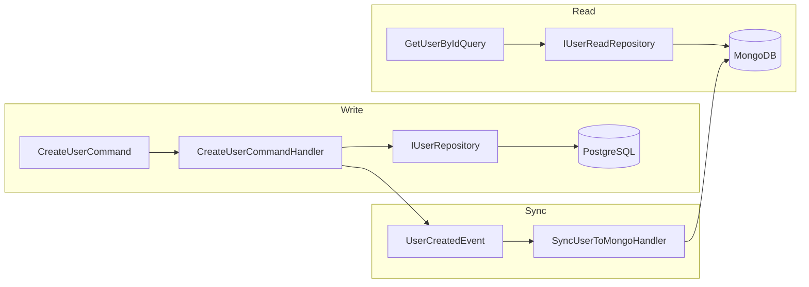

# Persistência Poliglota

Este documento descreve a estratégia de usar **PostgreSQL para escrita** e **MongoDB para leitura**, a sincronização via **Domain Events** e o uso de **Connection Pooling**.

---

## Visão Geral

O template adota **CQRS com persistência poliglota**:

- **Write side**: PostgreSQL + Entity Framework Core. Commands persistem na tabela `Users` e garantem consistência transacional.
- **Read side**: MongoDB com o driver nativo. Queries leem da collection `users` (modelo desnormalizado).
- **Sincronização**: após um write bem-sucedido, um **Domain Event** é publicado; um handler (**SyncUserToMongoHandler**) replica o dado para o MongoDB.

---

## Por que separar escrita e leitura?

- **Escala de leitura**: MongoDB pode ser replicado e escalado para muitas leituras sem impactar o banco transacional.
- **Modelo otimizado por uso**: o read model pode ser desnormalizado (ex.: campos extras para listagens) sem poluir o modelo de escrita.
- **Resiliência**: leituras continuam mesmo se o Postgres estiver sob carga; o read model é eventualmente consistente.

---

## Sincronização via Domain Events

1. **CreateUserCommandHandler** persiste o `User` no Postgres via `IUserRepository.AddAsync`.
2. O handler publica **UserCreatedEvent** (INotification) com os dados necessários para o read model.
3. **SyncUserToMongoHandler** (registrado no MediatR, assembly Infrastructure) recebe o evento e insere/atualiza o **UserReadModel** na collection MongoDB `users`.

O evento é **in-process** (MediatR); não há fila externa no template. Para ambientes distribuídos, o mesmo padrão pode ser estendido com um message broker (RabbitMQ, Kafka).

---

## Connection Pooling

- **PostgreSQL**: na connection string são usados `Pooling=true`, `MinPoolSize` e `MaxPoolSize` (configuráveis em `appsettings` e variáveis de ambiente). O provider Npgsql gerencia o pool.
- **MongoDB**: o driver usa pool nativo; parâmetros `minPoolSize` e `maxPoolSize` podem ser definidos na connection string (ex.: em `appsettings.Development.json`).

Isso reduz o custo de abertura/fechamento de conexões e melhora a **performance** sob carga.

---

## Modo In-Memory (testes e desenvolvimento)

Para testes e ambientes sem Postgres/Mongo, a configuração **Database:UseInMemory** (ou connection strings vazias) ativa:

- **EF Core In-Memory** para o write side.
- **InMemoryUserReadRepositoryAdapter**: implementa `IUserReadRepository` usando o próprio `IUserRepository` (write), convertendo `User` em `UserReadModel`. Assim, as Queries continuam funcionando sem MongoDB.

O **SyncUserToMongoHandler** verifica se o `MongoDbContext` está disponível; quando não está (modo in-memory), não executa a sincronização. Assim, a regra de negócio (email único, modelo rico) é testada sem depender de bancos externos.
