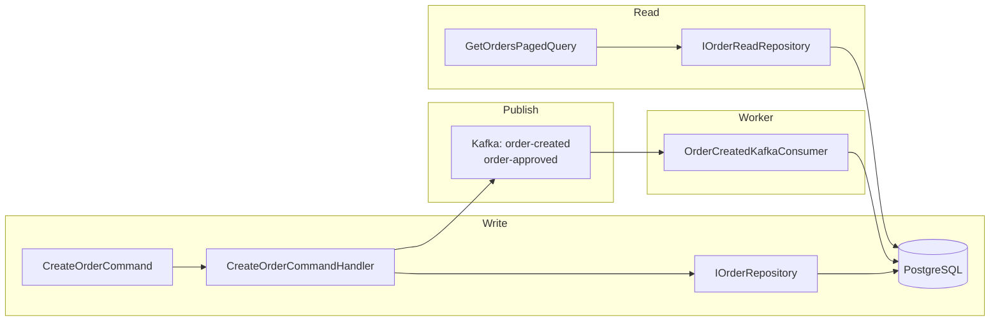

# Persistência e Eventos (PostgreSQL + Kafka)

Este documento descreve a estratégia de persistência em **PostgreSQL** (escrita e leitura) e o uso de **Kafka** para eventos assíncronos no **Minerva Gestão de Pedidos**.

---

## Visão Geral

O projeto adota **CQRS** com **um único banco transacional** e **eventos assíncronos**:

- **Persistência**: PostgreSQL + Entity Framework Core. Commands e Queries usam o mesmo banco; a separação é feita por repositórios de escrita (`IOrderRepository`, `IUserRepository`, etc.) e de leitura (`IOrderReadRepository`, `IUserReadRepository`, etc.) com `AsNoTracking` para consultas.
- **Eventos**: Kafka. A API publica em **order-created** (ao criar pedido) e em **order-approved** (ao aprovar). O **Worker** consome `order-created` e persiste **DeliveryTerm** no PostgreSQL (idempotente por OrderId).

---

## Por que PostgreSQL para leitura e escrita?

- **Simplicidade operacional**: um único banco para transações e consultas; sem sincronização entre Postgres e outro store.
- **Consistência forte**: leituras sempre refletem o último estado persistido.
- **Performance de leitura**: repositórios de leitura usam `AsNoTracking()` e `Include` apenas quando necessário, reduzindo overhead.

Se no futuro for necessário escalar leituras, pode-se introduzir um read model em outro store (ex.: MongoDB ou cache) alimentado pelos eventos Kafka, mantendo o mesmo padrão de eventos.

---

## Kafka: tópicos e uso

| Tópico           | Produtor        | Consumidor | Uso |
|------------------|-----------------|------------|-----|
| **order-created**  | WebApi (CreateOrder) | Worker     | Worker cria DeliveryTerm (10 dias) no Postgres; idempotente. |
| **order-created-dlq** | Worker (em falha após retries) | Conciliação manual | Mensagens que falharam no processamento. |
| **order-approved**  | WebApi (ApproveOrder) | Integrações externas (futuro) | Notificação de pedido aprovado. |

Padrão de nomes de tópicos: **hífens** (ex.: `order-created`, `order-approved`).

Quando **Kafka não está configurado** (ex.: ambiente sem broker), a Infrastructure registra publicadores **NoOp** (não publicam), permitindo que a API e os testes rodem sem Kafka.

---

## Connection Pooling (PostgreSQL)

Na connection string são usados `Pooling=true`, `MinPoolSize` e `MaxPoolSize` (configuráveis em `appsettings` e variáveis de ambiente). O provider Npgsql gerencia o pool.

Isso reduz o custo de abertura/fechamento de conexões e melhora a **performance** sob carga.

---

## Idempotência e concorrência

- **Criação de pedido**: a aplicação pode definir uma chave de idempotência (ex.: derivada de CorrelationId/CausationId). Duplicatas (ex.: clique duplo ou reprocessamento) resultam em **409 Conflict** (OrderAlreadyExistsException) ou constraint única no banco.
- **Worker (order-created)**: se já existir DeliveryTerm para o mesmo OrderId, a mensagem é ignorada e o offset é commitado (idempotência).

---

## Modo In-Memory (testes)

Para testes e ambientes sem Postgres, a configuração com connection string vazia ou provider **In-Memory** ativa:

- **EF Core In-Memory** para o write/read side.
- Os mesmos repositórios são usados; não há Kafka em testes unitários (publicadores NoOp ou mocks).

---

## Referências

- [architecture.md](./architecture.md) — Camadas da solução  
- [architecture-diagram.md](./architecture-diagram.md) — Diagrama de fluxo  
- Worker: `src/Worker/Minerva.GestaoPedidos.Worker/README.md`  
